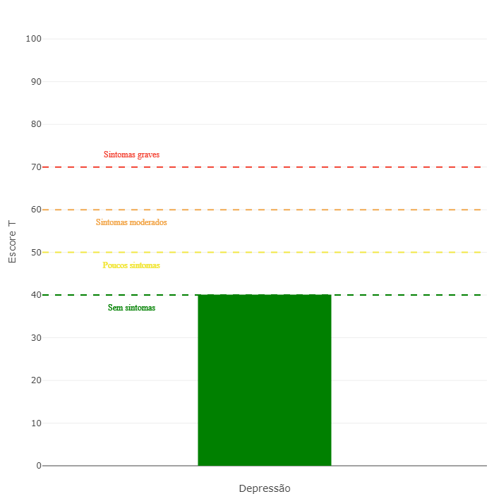

**Paciente**: `r params$nome` \hfill Data: `r format(Sys.Date(), "%d/%m/%y")`

**Pontuação**: `r round(params$escore, 2)`

```{r plot, echo=FALSE}
save_image(p = params$plot, file = 'plot.png', width = 700, height = 700, scale = 2)
```

{width=475px}

`r params$texto`

